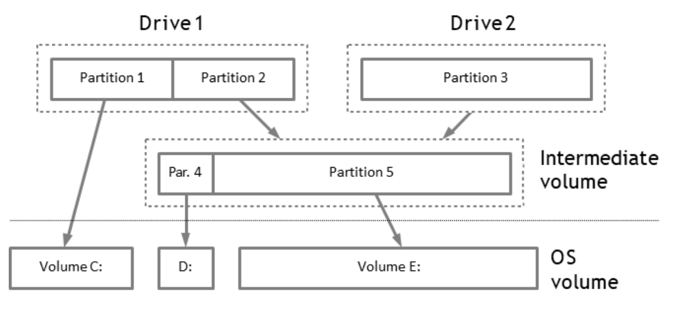
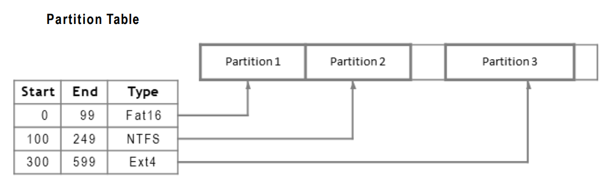

# Aula 7 - Volumes e partições

## Volumes

Um volume é uma área de armazenamento de dados que pode ser acessada por um sistema operativo. Pode ser criado juntando vários espaços de armazenamento pequenos, tornando-os num único espaço de armazenamento maior. Normalmente, nos sistemas operativos, os volumes são representados por letras (C:, D:, E:, etc.).

### Para que servem os volumes?

Os volumes são usados para:

- **Organizar os dados**: os dados podem ser organizados em volumes para facilitar a sua gestão.
- **Separar os ficheiros do SO dos ficheiros do utilizador**: os ficheiros do SO podem ser armazenados num volume e os ficheiros do utilizador noutro volume.
- **Permitir *dual boot***: é possível ter vários sistemas operativos instalados no mesmo computador, cada um num volume diferente.

### Agrupamento de volumes

O agrupamento de volumes é uma tecnologia que permite combinar vários volumes num único volume lógico. O agrupamento de volumes é usado para aumentar performance, prevenir falhas por redundância e aumentar a capacidade de armazenamento.

Existem alguns tipos de agrupamento de volumes:
- **RAID**: comum em sistemas de grande dimensão, consiste em dividir os dados por vários discos rígidos;
- **Spanning**: cria um volume lógico adicionando espaço livre de vários volumes menores;

## Partições

Uma partição é uma divisão lógica de um disco rígido que é tratada como uma unidade separada pelo sistema operativo. Uma partição é criada quando o disco rígido é formatado. Uma partição pode ser criada em qualquer disco rígido, independentemente do tamanho ou do número de partições já existentes.

Nota: Um volume pode corresponder a uma partição inteira ou a uma parte de uma partição.

### Tabela de Partições

A tabela de partições é uma estrutura de dados que contém informações sobre as partições de um disco rígido. A tabela de partições é criada quando o disco rígido é formatado. 

Existem dois tipos de dados que podem ser armazenados na tabela de partições:
- **Essencial data**: Inicio e fim de setor de cada partição.
- **Non-essential data**: Tipo de partição, tamanho da partição, etc.

Alguns tipos de tabelas de partições:
- MBR;
- GPT;
- FreeBSD;
- DOS;
- etc.;

## Endereçamento de setores

### Endereçamento LBA

O endereçamento LBA (Logical Block Addressing) é um método de endereçamento de setores de um disco rígido. Mapa os setores físicos do disco rígido, não pode ser usado para endereçar setores de um volume.

Estas são as camadas de endereçamento de um disco rígido:
- **Endereço físico**
- **Endereço lógico**: igual ao endereço físico;
- **Endereço lógico de partição**: cada partiçao tem o seu próprio endereço lógico;

## Testes de consistência
Estes são alguns testes de consistência que podem ser feitos num disco rígido:
- Verificar se a ultima partição termina no ultimo setor do disco rígido;
- Verificar se as partições estão sobrepostas;
- Verificar se as partições são consecutivas;

## Disktype tool

A ferramenta disktype permite identificar o tipo de partição de um disco rígido.

## Logical Volume Manager (LVM)

O LVM é um sistema de gestão de volumes lógicos que permite criar volumes lógicos de forma dinâmica a partir de vários discos rígidos.