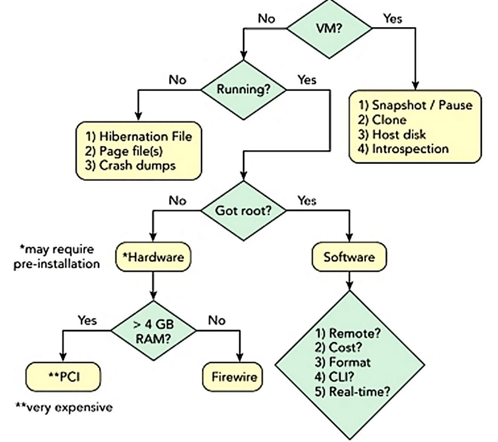

# Aula 8 - Análise de RAM

## Informação Volátil

A informação volátil é a informação que é perdida quando o computador é desligado. A informação volátil é armazenada na RAM (Random Access Memory). Pode conter, código malicioso de uma infeção, chaves de cifra e palavras-passe.

## Direct Memory Access (DMA)

O DMA é um método que permite que os dispositivos de I/O transfiram dados diretamente para a RAM, sem a intervenção do CPU. O DMA é usado para aumentar a performance do computador.

## Paging

O paging é um método de gestão de memória que permite que o sistema operativo transfira páginas de memória para o disco rígido, quando a RAM está cheia. O paging é usado para aumentar a capacidade de memória do computador.

## Impacto na análise forense da memória

O software forense deve emular o espaço de endereço virtual e tratar de forma transparente a tradução de endereços virtuais para físicos.

## Memory Acquisition (Aquisição de Memória)

A aquisição de memória é o processo de copiar o conteúdo da memória para um ficheiro, de modo a obter um melhor entendimento do que aconteceu no computador.

Existem alguns riscos associados à aquisição de memória, como:
- A maioria dos SOs não fornece um mecanismo nativo suportado para aquisição de memória física;
- As ferramentas de aquisição de memória podem deixar o sistema instável;
- O malware mal escrito pode ser instável e ter um comportamento imprevisível;

A aquisição de memória pode ser levar a instabilidades no sistema e corrupção de evidências, devido a:
- **Atomicidade**: este processo não é atómico, ou seja, não é possível garantir que o conteúdo da memória não foi alterado durante a aquisição;
- **Coerência de cache**: os processadores não foram desenhados para acoplar de uma forma simultanea a memória alocada no mesmo endereço físico com os diversos atributos do cache;
- **Memória do dispositivo**: alguma da memória fisica é usada por firmware, ou dispositivos da motherboard, a leitura de memória desses dispositivos pode causar instabilidade no sistema;

### Software Memory Acquisition

Decisões a fazer:

- **remoto ou local** - existe acesso físico ao sistema alvo? É um servidor sem teclado ou monitor ligado?
- **custo** - existem restrições orçamentais quanto ao software de aquisição que pode comprar?
- **formato de ficheiro** - a ferramenta de análise suporta o formato de ficheiro da ferramenta de aquisição?
- **CLI ou GUI** - ferramentas de linha de comando ou de interface gráfica do utilizador? Uma ferramenta CLI pode ter uma ferramenta CLI pode ter uma pegada mais pequena, além de que pode não ter um motor gráfico a executar a aquisição ou o tempo de execução.

O processo é o seguinte:
1. Carregar um módulo do kernel que mapeia os endereços físicos desejados no espaço de endereço virtual de um processo;
2. Aceder aos dados do espaço de endereço virtual;
3. Escrever o conteúdo no armazenamento não-volátil solicitado;
4. A maioria das ferramentas evita a aquisição de regiões de memória do dispositivo;

## Algumas ferramentas de aquisição de memória

- **FTK Imager**: Ferramenta de aquisição de memória que permite criar uma imagem de memória de um computador.

- **Volatility**: A ferramenta *volatility* permite analisar o conteúdo da memória de um computador.

- **Rekall**: Uma ramificação da ferramenta *volatility*, que permite analisar o conteúdo da memória de um computador.